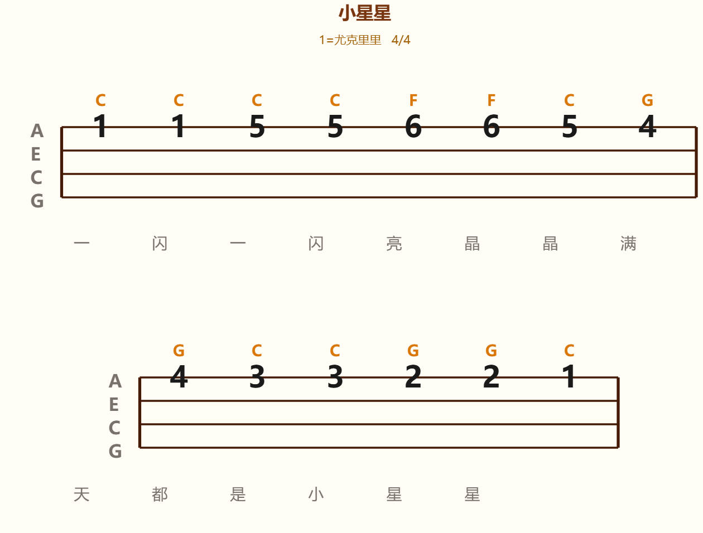

# 🎸 GuitarMusicScore 吉编行

一款简洁好用的吉他/尤克里里琴谱编辑工具，支持音符编辑、和弦标注、歌词添加、图片导出等功能。


## ✨ 功能特点

- 🎵 **多乐器支持** - 支持吉他（6弦）、尤克里里（4弦）和钢琴（数字简谱）
- 🎼 **音符编辑** - 可视化编辑音符音高和谱线位置
- 🎸 **和弦标注** - 内置丰富和弦库，支持快速选择
- 📝 **歌词添加** - 支持为每个音符添加歌词
- 🖼️ **图片导出** - 一键导出为PNG图片
- 📋 **示例乐谱** - 内置多首经典曲目示例

## 🖼️ 界面预览

### 尤克里里模式


### 钢琴模式


## 🚀 快速开始

### 安装依赖

```bash
npm install
```

### 开发模式

```bash
npm run dev
```

访问 http://localhost:5173

### 构建生产版本

```bash
npm run build
```

打包后的文件在 `dist` 目录。

## 📖 使用说明

### 1. 选择乐器
点击顶部工具栏选择「尤克里里」、「吉他」或「钢琴」，谱线数量会自动切换。

### 2. 添加音符
- 点击「＋ 添加音符」按钮
- 设置各弦音高（1-7或0休止符，钢琴模式直接输入数字）
- 钢琴模式支持八度（上加点表示高音，下加点表示低音）和升降调

### 3. 添加和弦
- 选中已有音符
- 在和弦选择器中选择和弦（或使用快速和弦按钮）
- 支持按和弦类型分组浏览

### 4. 添加歌词
- 选中音符
- 在编辑面板输入歌词

### 5. 导出图片
- 点击「🖼️ 保存图片」按钮
- 自动生成PNG格式琴谱图片

## 📂 项目结构

```
GuitarMusicScore/
├── src/
│   ├── components/   # Vue组件
│   │   ├── MusicScoreEditor.vue  # 琴谱编辑器主组件
│   │   ├── ScoreEditor.vue       # 音符编辑面板
│   │   ├── ScorePreview.vue      # 谱子预览
│   │   ├── ChordSelector.vue     # 和弦选择器
│   │   └── ToolBar.vue          # 工具栏
│   ├── stores/       # Pinia状态管理
│   │   └── musicScore.js
│   ├── data/         # 数据文件
│   │   ├── chords.js  # 和弦库
│   │   └── *.json     # 示例乐谱
│   ├── assets/       # 静态资源
│   ├── App.vue
│   └── main.js
├── public/           # 公共资源
│   └── img/          # 预览图片
├── index.html        # 入口HTML
├── vite.config.js    # Vite配置
└── package.json
```

## 🛠️ 技术栈

- **前端框架**: Vue 3 + Composition API
- **状态管理**: Pinia
- **UI组件**: Element Plus
- **构建工具**: Vite 5.4

## 📄 许可证

MIT License

---

Made with ❤️ for music lovers
